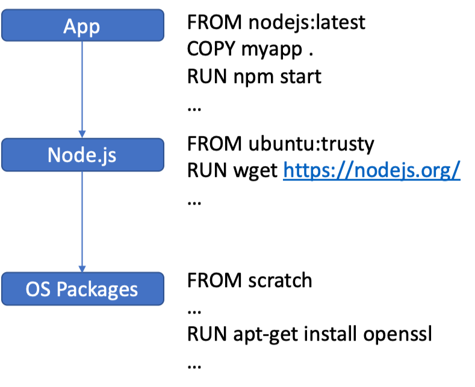
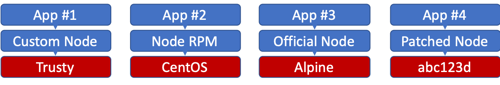
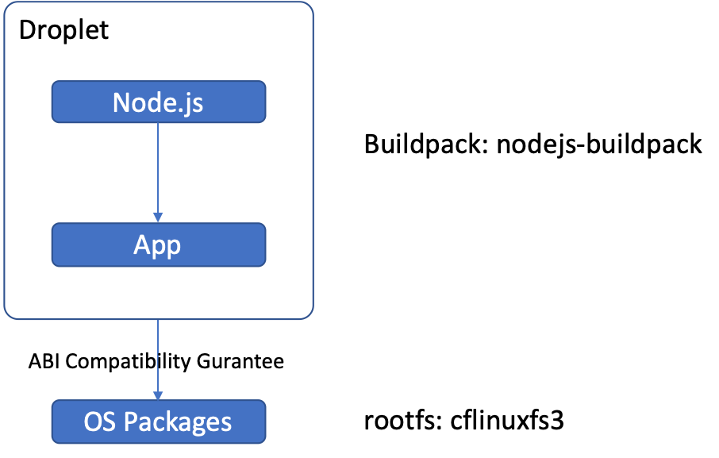
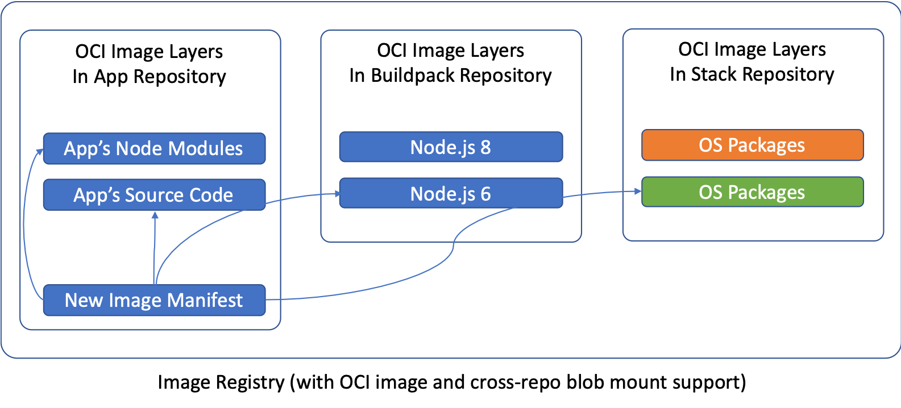

# Cloud Native Buildpack (CNB)

https://buildpacks.io/


- CNCF의 sandbox project로 Salesforce의 Heroku 와 Cloud Foundry
- Dockerfile 필요없이, source code에서 직접 OCI-compliant image 를 만듬
- Remote image layer insertion and rebasing on Docker registries to:
  - Take advantage of compatibility gurantees (e.g., ABI compatibility of OS libs)
  - Minimize build time and data transfer
- Polyglot Programming Language support : Ruby, Node.js, Java, Python, PHP, or Go
- **Application developers** to use Cloud Native Buildpacks to convert code into runnable images
- **Buildpack authors** to develop and package buildpacks for distribution


## Docker Images
- Node.js App
 
- ssl cve patch
 
- Node.js App with buildpack



Time to deploy 500 new images, likely minutes


## Optimized Builds - How it works
- Only re-builds and uploads layers when necessary
- OCI image specification: content addressable layers
- Docker Registry v2: cross repository blob mounting

**Result**

**Fast builds, mionimal data transfer, layer "rebasing" directly on the registy!**

example of running the Heroku Cloud Native Ruby buildpack against a Rails app:


https://github.com/buildpack/pack/releases   (pack v0.5.0 - 2019.12.05)


## Installation
```bash
brew tap buildpack/tap
brew install pack
```
또는
1. Download the .tgz or .zip file for your platform
2. Extract the pack binary

## Run

pack 을 실행

```log
Usage:
  pack [command]

Available Commands:
  build                 Generate app image from source code
  run                   Build and run app image (recommended for development only)
  rebase                Rebase app image with latest run image
  create-builder        Create builder image
  set-run-image-mirrors Set mirrors to other repositories for a given run image
  inspect-builder       Show information about a builder
  set-default-builder   Set default builder used by other commands
  suggest-builders      Display list of recommended builders
  version               Show current 'pack' version
  help                  Help about any command

Flags:
  -h, --help         Help for 'pack'
      --no-color     Disable color output
  -q, --quiet        Show less output
      --timestamps   Enable timestamps in output

Use "pack [command] --help" for more information about a command.
```

## Select a builder
```bash
$ pack suggest-builders
Suggested builders:
	Cloud Foundry:     cloudfoundry/cnb:bionic         Ubuntu bionic base image with buildpacks for Java, NodeJS and Golang
	Cloud Foundry:     cloudfoundry/cnb:cflinuxfs3     cflinuxfs3 base image with buildpacks for Java, .NET, NodeJS, Python, Golang, PHP, HTTPD and NGINX
	Heroku:            heroku/buildpacks:18            heroku-18 base image with buildpacks for Ruby, Java, Node.js, Python, Golang, & PHP

Tip: Learn more about a specific builder with:
	pack inspect-builder [builder image]
```

```
$ pack set-default-builder cloudfoundry/cnb:bionic
Builder cloudfoundry/cnb:bionic is now the default builder
```

## Build app
```
pack build sample-app .
```

docker image 확인
```
docker image ls 
```


## 참고 자료
- [How Pivotal Cloud Foundry Buildpacks Work](https://www.youtube.com/watch?v=1JKLiPBmlIc)
- [Buildpacks Can Be Better](https://www.youtube.com/watch?v=J6zn3WRqJko)
- [Intro To Cloud Native Buildpacks](https://www.youtube.com/watch?v=t3C2nW0WTRo&feature=youtu.be)
- [The Future of Opinionated Buildpacks](https://www.youtube.com/watch?v=spW9ZlJpobM)