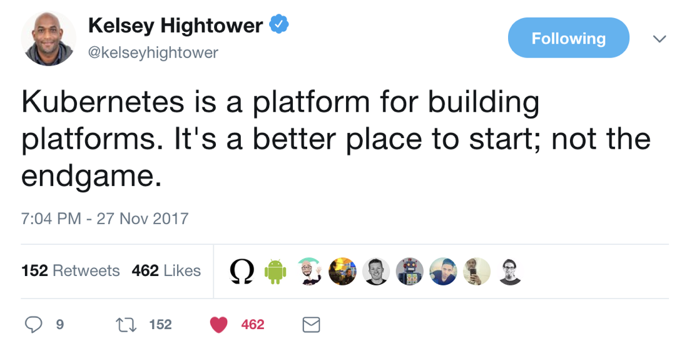
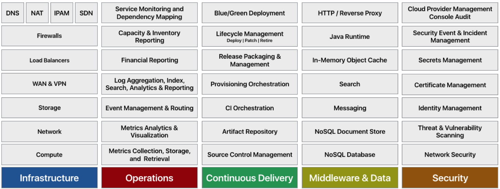

## PCF (Pivotal Cloud Foundry) - PAS/PKS/PFS

### Five Domains of a Cloud Native Platform

### Comparing Spring Boot app deployment process
|Spring Boot app deployed to **K8s**  | Spring Boot app deployed to **PAS**  |
|---|---|
|Compile Spring Boot app |Compile Spring Boot app|
|Choose base Docker image|Create manifest.yml describe the app|
|Author Dockerfile w/ app entrypoint|Use CI/CD tool or **cf push** to deploy|
|Build Docker image|Profit!|
|Upload image to container registry||
|Decide on JVM tuning parameters to use when starting pods||
|Create kubernetes deployment config||
|Use CI/CD tool or kubectl to apply kubernetes configuration and deploy pods||
|Create service to expose pod for users||
|Profit!||

### 

