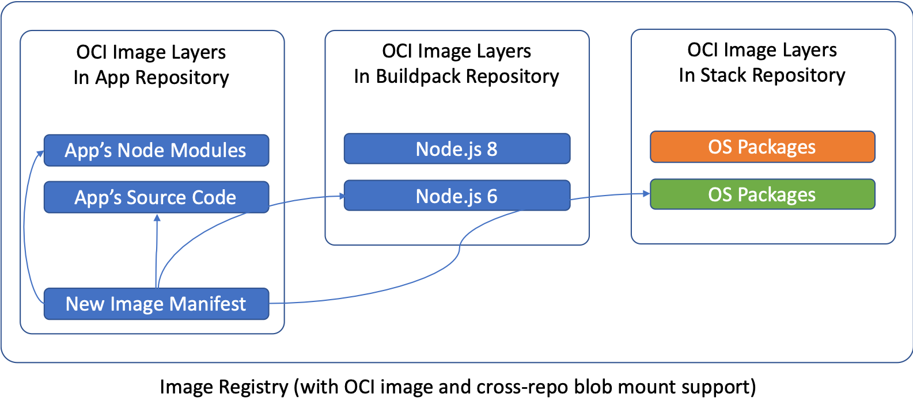

### Dockerizing

#### Using Dockerfile & docker build
##### Downloading the application to Dockerize
참고: 
https://www.callicoder.com/spring-boot-websocket-chat-example/

```
git clone https://github.com/callicoder/spring-boot-websocket-chat-demo
```

##### Docker
```dockerfile
# Start with a base image containing Java runtime
FROM openjdk:8-jdk-alpine
# Add Maintainer Info
LABEL maintainer="callicoder@gmail.com"
# Add a volume pointing to /tmp
VOLUME /tmp
# Make port 8080 available to the world outside this container
EXPOSE 8080
# The application's jar file
ARG JAR_FILE=target/websocket-demo-0.0.1-SNAPSHOT.jar
# Add the application's jar to the container
ADD ${JAR_FILE} websocket-demo.jar
ENV SPRING_OPTS=""
ENV JAVA_OPTS="-Xmx128m -Djava.security.egd=file:/dev/./urandom $SPRING_OPTS"
# Run the jar file 
ENTRYPOINT ["java","$JAVA_OPTS","-jar","/websocket-demo.jar"]
```

```
$ docker build -t spring-boot-websocket-chat-demo .
```
or
```
$ mvn package
```

#### docker-maven-plugin


```xml
  <plugin>
    <groupId>io.fabric8</groupId>
    <artifactId>docker-maven-plugin</artifactId>
    <version>${fmp.version}</version>
  </plugin>
```
or fabric8-maven-plugin
```xml
      <plugin>
        <groupId>io.fabric8</groupId>
        <artifactId>fabric8-maven-plugin</artifactId>
        <version>${fabric8.maven.plugin.version}</version>
        <executions>
          <execution>
            <goals>
              <goal>resource</goal>
              <goal>build</goal>
            </goals>
          </execution>
        </executions>
      </plugin>
```

Build Docker images
```bash
mvn package docker:build
```
or
```bash
mvn fabric8:build
```

#### docker-gradle-plugin

```build
buildscript {
    repositories {
        jcenter()
    }
    dependencies {
        classpath 'com.bmuschko:gradle-docker-plugin:3.0.3'
    }
}

apply plugin: 'com.bmuschko.docker-remote-api'
import com.bmuschko.gradle.docker.tasks.image.DockerBuildImage

docker {
    if (System.env.containsKey('DOCKER_HOST') && System.env.containsKey('DOCKER_CERT_PATH')) {
        url = System.env.DOCKER_HOST.replace("tcp", "https")
        certPath = new File(System.env.DOCKER_CERT_PATH)
    }
}

task buildImage(type: DockerBuildImage) {
    dependsOn assemble
    inputDir = project.rootDir
    tag = "arquillian/game-service:${project.version}"
}
```


#### Cloud Native Buildpack (CNB)

https://buildpacks.io/


- CNCF의 sandbox project로 Salesforce의 Heroku 와 Cloud Foundry
- Dockerfile 필요없이, source code에서 직접 OCI-compliant image 를 만듬
- Remote image layer insertion and rebasing on Docker registries to:
  - Take advantage of compatibility gurantees (e.g., ABI compatibility of OS libs)
  - Minimize build time and data transfer
- Polyglot Programming Language support : Ruby, Node.js, Java, Python, PHP, or Go
- **Application developers** to use Cloud Native Buildpacks to convert code into runnable images
- **Buildpack authors** to develop and package buildpacks for distribution


##### Docker Images
- Node.js App
 
- ssl cve patch
 
- Node.js App with buildpack



Time to deploy 500 new images, likely minutes


##### Optimized Builds - How it works
- Only re-builds and uploads layers when necessary
- OCI image specification: content addressable layers
- Docker Registry v2: cross repository blob mounting

**Result**

**Fast builds, mionimal data transfer, layer "rebasing" directly on the registy!**

example of running the Heroku Cloud Native Ruby buildpack against a Rails app:


https://github.com/buildpack/pack/releases/tag/v0.1.0


##### Installation
```bash
brew tap buildpack/tap
brew install pack
```
또는
1. Download the .tgz or .zip file for your platform
2. Extract the pack binary

##### Run

pack 을 실행

```log
Usage:
  pack [command]

Available Commands:
  build                 Generate app image from source code
  run                   Build and run app image (recommended for development only)
  rebase                Rebase app image with latest run image
  create-builder        Create builder image
  set-run-image-mirrors Set mirrors to other repositories for a given run image
  inspect-builder       Show information about a builder
  set-default-builder   Set default builder used by other commands
  suggest-builders      Display list of recommended builders
  version               Show current 'pack' version
  help                  Help about any command

Flags:
  -h, --help         Help for 'pack'
      --no-color     Disable color output
  -q, --quiet        Show less output
      --timestamps   Enable timestamps in output

Use "pack [command] --help" for more information about a command.
```

