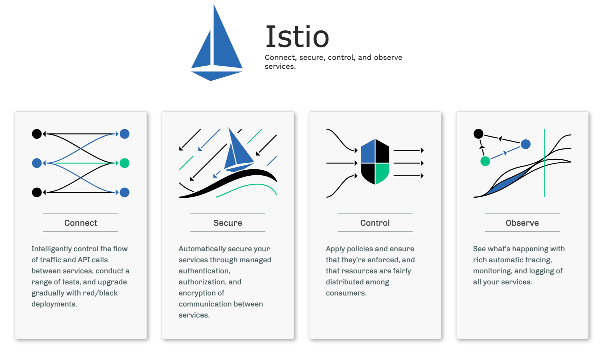

## Istio - A service mesh for Microservices

Istio 는 Google, IBM, Redhat, Lyft, VMware 와 같은 다수의 업체들이 참여하여 Service Mesh를 쉽게 제공하는 오픈소스이다. 대규모 마이크로서비스 환경에서 서비스를 연결, 보안, 제어 및 관찰 할 수 있는 방안을 쉽게 제공할 수 있도록 지원한다

### Istio Architecture

- Envoy : Proxy 역할을 수행하며, Pod에 Sidecar패턴 형태로 배포되어 Service Mesh의 다른 서비스에 대한 트래픽을 조정, 기존 어플리케이션을 수정하지 않고 기능을 추가/변경할 수 있음
  - Dynamic service discovery
  - Load balancing
  - TLS termination
  - HTTP/2 and gRPC proxies
  - Circuit breakers
  - Health checks
  - Staged rollouts with %-based traffic split
  - Fault injection
  - Rich metrics
- Pilot
  - Proxy에 대한 서비스 검색, 지능형 라우팅(A/B테스트, Canary 롤아웃, Black Mirror등)및 탄력성(Resiliency-시간초과,재시도,circuit breaker등)을 위한 트래픽 관리 기능을 제공
  - 서비스 디스커버리, 로드 밸런싱 조정 풀 및 라우팅 테이블 동적업데이트(healthcheck)를 가능하게 함
- Citadel
  - 보안에 관련된 기능을 하는 컴포넌트이다. 서비스를 사용하기 위한 사용자 인증(Authn), 인가(Authz)을 담당하고, 통신에 mTLS를 이용하여 암호화할 수 있다.
  - k8s 의 ServiceRole, ServiceRoleBinding을 사용한다.
- Mixer
  - 액세스 컨트롤, 정책 통제 그리고 각종 모니터링 지표의 수집이다.

#### Traffic Management

##### Communication between services

##### Discovery and Load balancing

<!-- ##### Handling failures
- Timeouts
- Bounded retiries with timeout budgets and bariable jitter between retries
- Limits on number of concurrent connections and request to upstream servics
- Active(periodic) health checks on each member of the load balancing ppol
- Fine-grained circuit breakers(passvie health checks) - applied per instance in the load balancing pool -->

#### Istio Component
- Virtual Service
- Gateway : Ingress와 비교하여 L3~L6까지에서의 LB를 담당
- DestinationRule : virtualservice 라우팅이 발생한 후 요청에 적용될 정책 집합을 구성하며, Circuit Breaker나 로드밸런서 설정, mTLS

Istio의 서비스 흐름 :
Istio Gateway > VirtualService > K8s Service

#### Mixer Performance

- nomixer-both Same as both-sidecars without Mixer. MixerV2 latency profile will be similar.
- nomixer-server Same as server-sidecar without Mixer. MixerV2 latency profile will be similar.

