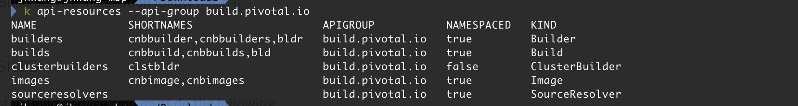
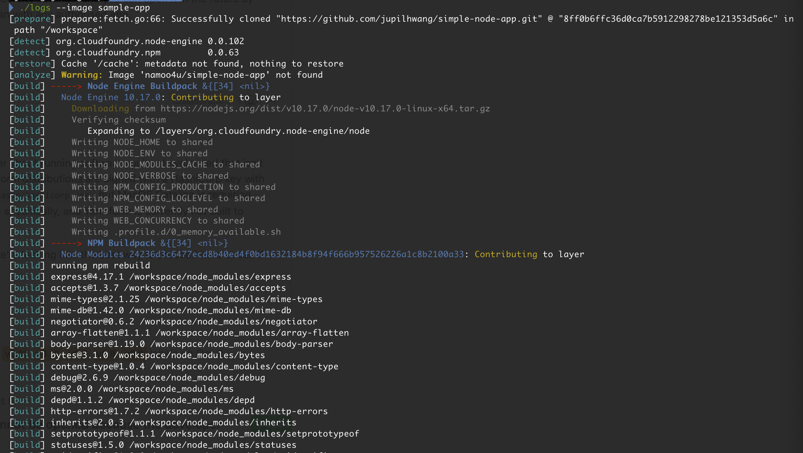
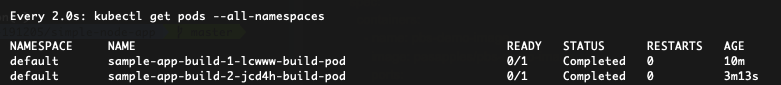

# KPack
- Kubernetes Container Native BuildPack

---
## Reference Links
- [Introducing kpack, a Kubernetes Native Container Build Service](https://content.pivotal.io/blog/introducing-kpack-a-kubernetes-native-container-build-service)
- [Github kpack](https://github.com/pivotal/kpack)
---
## Installing Kpack

  - Download "release.yml"
  ```bash
  kapp deploy -a kpack -f release.yaml
  ```



---
  - Testing
  ```bash
  kubectl get pods -n kpack
  ```

  - Checking
  ```bash
  kubectl -n kpack logs deployment/kpack-controller -f

  ```
---
### Create Builder
```yaml
apiVersion: build.pivotal.io/v1alpha1
kind: Builder
metadata:
  name: default-builder
spec:
  image: cloudfoundry/cnb:bionic
  updatePolicy: Polling
```
---
### Create a secret and a service account

docker-secret.yaml
  ```yaml
apiVersion: v1
kind: Secret
metadata:
  name: basic-docker-user-pass
  annotations:
    build.pivotal.io/docker: index.docker.io
type: kubernetes.io/basic-auth
stringData:
  username: namoo4u
  password: 
  ```
using kubectl
```bash
kubectl create sercet docker-registry docker-hub-secret --docker-username=namoo4u --docker-password=
```
---

git-secret.yaml
  ```yaml
apiVersion: v1
kind: Secret
metadata:
  name: basic-git-user-pass
  annotations:
    build.pivotal.io/git: https://github.com
type: kubernetes.io/basic-auth
stringData:
  username: jupil.hwang@gmail.com
  password: 
  ```

---
service-account.yaml
```yaml
apiVersion: v1
kind: ServiceAccount
metadata:
  name: service-account
secrets:
  - name: basic-docker-user-pass
  - name: basic-git-user-pass
```

---
## Image from a Git Source


---
```yaml
apiVersion: build.pivotal.io/v1alpha1
kind: Image
metadata:
  name: sample-app
spec:
  tag: namoo4u/simple-node-app
  serviceAccount: service-account
  builder: 
    name: default-builder
    kind: Builder
  failedBuildHistoryLimit: 5
  successBuildHistoryLimit: 5
  source:
    git:
      url: https://github.com/jupilhwang/simple-node-app.git
      revision: master
  build:
    end:
      - name: ENV-NAME
        value: ENV-VALUE
    resources:
      limits:
        cpu: 2000m
        memory: 512M
      requests:
        cpu: 1000m
        memory: 256M
```
---
logs cli를 사용하여 현재 cnbuild 의 로그를 확인 할 수 있다.


---
## Source 변경하면 자동으로 변경된 도커이미지를 만들어준다


Dockerhub을 확인해 본다


## Dekorate

