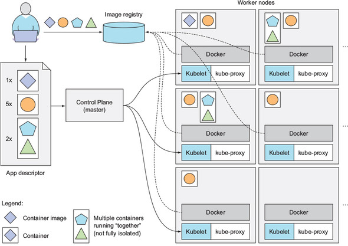

## Kubernetes

"두말하면 잔소리" 사실상 표준

### Docker의 등장 (2013) 이후 

### Kubernetes의 등장 (2014)

- Container orchestration system
- Google Borg System에 영감을 받아서 만들었다고 함
- v1.0 : July 21, 2015
- 막강한 커뮤니티의 힘, echo systems

#### A basic overview of the kubernetes architecture

source: Kubernetes In Action (book)

#### Kubernetes architecture diagram

source: https://en.wikipedia.org/wiki/Kubernetes

#### Kubernetes Objects
- Pods
- Services
- Volumnes
  - persistentvolume
  - persistentvolumeclaim
  - storageclass
- Namespacs
- Labels and selector
- 다양한 배포방식 
  - Daemon set
  - Deployment / Replicaset
  - Stateful Sets / Replicaset
  - Cronjob / job
  - Replication Controller
- Configmaps / Secrets
- Ingress / Ingress Controller
- CRD (Custom Resource Definition)
- HPA (Horizontal Pod Autoscaling)
- Interfaces
  - CRI (Container Runtime Interface) : container-d, rkt, cri-o
  - CNI (Container Network Interface) : flannel, weave, cillium, nsx-t
  - CSI (Container Storage Interface)

#### CNCF landscape - Kubernetes Echosystems

source: https://landscape.cncf.io/images/landscape.png

