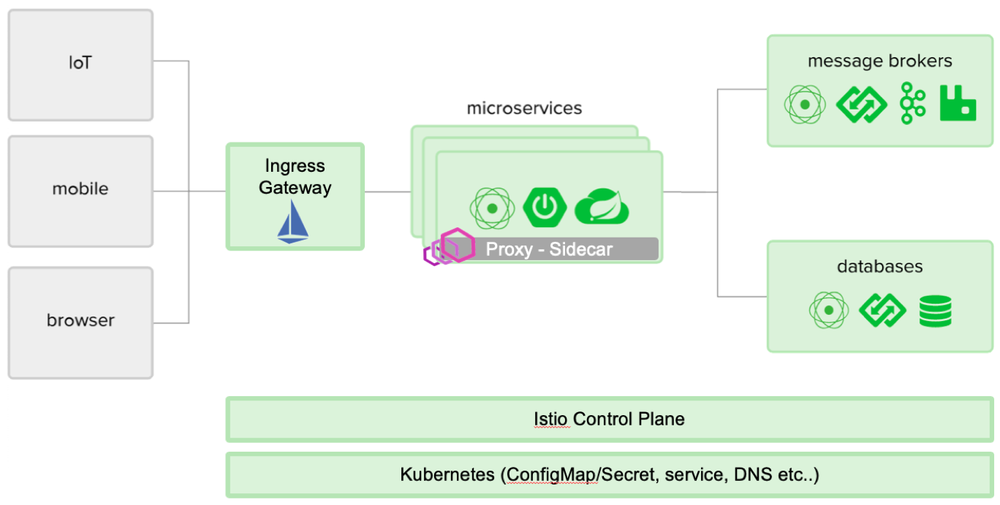

### 12-factor and beyond 12-factor

  - 설정 자동화를 위한 절차(declarative) 를 체계화 하여 새로운 개발자가 프로젝트에 참여하는데 드는 시간과 비용을 최소화한다.
  - OS에 따라 달라지는 부분을 명확히하고, 실행 환경 사이의 이식성을 극대화 한다.
  - 최근 등장한 클라우드 플랫폼 배포에 적합하고, 서버와 시스템의 관리가 필요없게 된다.
  - 개발 환경과 운영 환경의 차이를 최소화하고 민첩성을 극대화하기 위해 지속적인 배포가 가능하다.
  - 툴, 아키텍처, 개발 방식을 크게 바꾸지 않고 확장(scale up) 할 수 있다.

출처 : https://12factor.net/ko/

### A comparison of platforms
| Microservices concern  |Spring Cloud & Netflix OSS|Kubernetes|
|---|---|---|
|**Configuration management**: configuration for a microservice application needs to be externalized from the code and be retrievable via a simple service call.    |Spring Config Server, Netflix Archaius both support a git-repository based location for configuration. Archaius supports data typing of configuration.    |Kubernetes ConfigMaps exposes the configuration stored in etcd via services. Kubernetes Secrets supports the service-based secure deployment and usage of sensitive configuration information (such as passwords, certificates, etc.).   |
|**Service discovery**: maintain a list of service instances that are available for work within a microservice domain. |Spring Cloud Eureka allows clients to register to it, maintains a heartbeat with registered clients, and maps service names to hostnames for clients that look up services by service name. |Kubernetes Services provide deployment time registration of instances of services that are internally available within the cluster. Ingress is a mechanism whereby a service can be exposed to clients outside the cluster. |
|**Load balancing**: The key to scaling a distributed system is being able to run more than one instance of a component. Load has to be then distributed across those instances via a load balancer. |Spring Cloud Ribbon provides the ability for service clients to load balance across instances of the service. |Kubernetes Service provides the ability for the service to be load balanced across service instances. This is not the equivalent of what Ribbon provides. |
|**API gateway**: The granularity of APIs provided by microservices is often different than what a service client needs. API Gateways implement facades and provide additional services like proxying, and protocol translation, and other management functions. |Spring Cloud Zuul provides configuration based API facades |Kubernetes Service and Ingress resources, Istio, Ambassador are solutions that provide both north-south (traffic into and out of data center) as well as east-west (traffic across data centers or clouds or regions) API gateway functions. |
|**Security concerns**: many security concerns are pushed to the API gateway implementation. With distributed microservice applications, it makes sense to not reinvent the security wheel and allow for policy definition and implementation in components that are shared by all services. |Spring Cloud Security addresses many security concerns through Spring Cloud Zuul |The Kubernetes ecosystem provides service meshes like Istio, which are capable of providing security through their API gateway mechanims. |
|**Centralized logging**: it is important to have a centralized log gathering and analysis infrastructure to manage a plethora of services – many of which are operating in a distributed fashion. |ELK Stack (Elasticsearch, LogStash, Kibana) |EFK Stack (Elasticsearch, Fluentd, Kibana) |
|**Centralized metrics**: a centralized area where the health and performance of the individual and overall system is essential to proper operations. |Spring Spectator & Atlas |Heapster, Prometheus, & Grafana |
|**Distributed tracing**: per-process logging and metric monitoring have their place, but neither can reconstruct the complex paths that transactions take as they propagate across a distributed system. Distributed tracing is an essential tool for a microservices platform. |Spring Cloud Sleuth |Hawkular|
|**Resilience and fault tolerance**: distributed systems must be capable of auto-routing around failures, and be capable of routing requests to the service instance that will provide an optimum response. |Spring Hystrix, Turbine, & Ribbon |Health check, service meshes (example: Istio) |
|**Autoscaling and self-healing**: distributed systems respond to higher load by scaling horizontally: the platform must detect and auto-respond to such conditions. Furthermore, the system needs to detect failures and attempt auto-restarts without operator input. |-|Docker, Rkt, Kubernetes Scheduler & Deployment, Helm|
|**Job management**: scheduled computations disconnected from any individual user requests |Spring Batch |Kubernetes Jobs and Scheduled Jobs |
|**Singleton application**: run specific services as a single instance of it within the entire system |Spring Cloud Cluster |Kubernetes Pods |

출처: https://en.wikipedia.org/wiki/Microservices#A_comparison_of_platforms

### ConfigMaps
- [ConfigMap/Secret](configmaps.md)

### Istio
- [Istio](istio.md)

### Spring Cloud Kubernetes

https://github.com/spring-cloud/spring-cloud-kubernetes

- Service Discovery
  - Spring Discovery Client using Kubernetes Service Discovery

- ConfigMap Property Source
  - Use Kubernetes ConfigMap/Secrets as Spring Property Source
  - Reload application properties when a ConfigMap or Secret changes

- Client-side Load Balaner
  - Using server list obtained from Kubernetes Endpoints

- Zipkin Service Discovery
  - Using Zipkin with Kubernetes for distributed tracing

